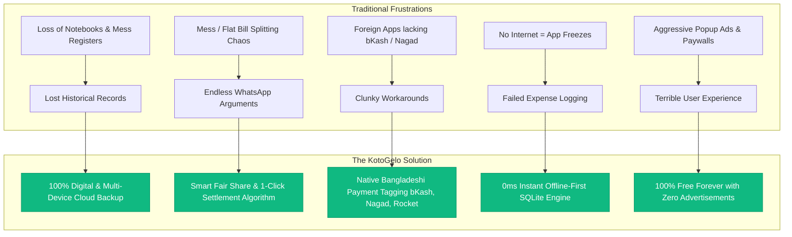

<div align="center">

# 🌐 KotoGelo Web Portal & Landing Platform

### _Modern Marketing Engine, Live Product Showcase & Web Client for KotoGelo Ecosystem_

[](https://nextjs.org/)
[](https://react.dev/)
[](https://www.typescriptlang.org/)
[](https://tailwindcss.com/)
[](https://lucide.dev/)
[](#)

<p align="center">
  <b>KotoGelo Web</b> (কত গেলো?) is the flagship landing platform, interactive product showcase, and digital portal for the KotoGelo ecosystem. Built with Next.js 15 (App Router), React 19, TypeScript, and Tailwind CSS, it offers a visual experience detailing the problems KotoGelo solves, feature breakdowns, architecture showcases, interactive phone mockups, and application download distribution.
</p>

---

</div>

## 📑 Table of Contents

- [🎯 Problems Solved (Why KotoGelo?)](#-problems-solved-why-kotogelo)
- [🌟 Key Feature Highlights](#-key-feature-highlights)
- [🛠 Full-Stack Tech Ecosystem](#-full-stack-tech-ecosystem)
- [📂 Web Project Directory Structure](#-web-project-directory-structure)
- [📊 Feature & Solution Comparison Matrix](#-feature--solution-comparison-matrix)
- [🔄 How It Works (3-Step Lifecycle)](#-how-it-works-3-step-lifecycle)
- [⚙️ Environment & Configuration](#️-environment--configuration)
- [🚀 Quickstart & Local Development](#-quickstart--local-development)
- [🎨 UI/UX Component Library & Design Tokens](#-uiux-component-library--design-tokens)
- [📦 Deployment & Production Build](#-deployment--production-build)
- [📄 License & Authors](#-license--authors)

---

## 🎯 Problems Solved (Why KotoGelo?)

Managing personal daily expenses and collective group finances has traditionally been frustrating, prone to human error, and confusing. **KotoGelo was engineered from the ground up to solve these core real-world pain points:**



### 1. The "Bachelor Mess & Roommate" Nightmare Solved

- **Problem:** In flat shares and bachelor messes, keeping track of bazar shopping, cook bills, utility costs, and mill rates usually results in messy physical registers and awkward money disputes.
- **Solution:** KotoGelo's **Group Fund & Deposit Engine** lets members deposit upfront funds (Cash, bKash, Nagad). When groceries or utilities are recorded from the group fund, every member's balance updates in real-time with zero ambiguity.

### 2. Tour & Hangout Bill Splitting Without Math Headaches

- **Problem:** On tours (Sajek, Cox's Bazar, Sylhet), multiple members pay for fuel, hotels, or restaurants, making final debt calculations a confusing mess of cross-payments.
- **Solution:** KotoGelo's **Greedy Debt Simplification Engine** computes the minimum necessary transactions (e.g. Member A pays Member B directly), instantly squaring all accounts.

### 3. Local-First Bangladeshi Financial Integration

- **Problem:** Western expense tracker apps do not understand Bangladeshi payment realities (`৳ BDT`, bKash, Nagad, Rocket, Bank Transfer, or Mess mill rates).
- **Solution:** Built specifically for Bangladesh with native currency formatting, localized payment tagging, and intuitive Bengali UI cues.

### 4. Zero Latency Offline Reliability

- **Problem:** Slow mobile internet causes traditional web apps to hang when opening or entering expenses.
- **Solution:** 0ms instant SQLite local hydration; the app opens and records transactions instantly even with zero network connectivity.

---

## 🌟 Key Feature Highlights

### ⚡ 1. 2-Second Quick Expense Logging

- Add food, commute, grocery, or utility expenses in just two taps.
- Instant category and subcategory auto-assignment with recognizable emojis.
- Tag payments to Cash, bKash, Nagad, Rocket, or Bank accounts.

### 👥 2. Collaborative Group Funds & Ledger

- Create specialized groups for **Mess, Roommates, Friends, Tours, Trips, Office, Family, or Students**.
- Track **Total Group Fund**, **Your Deposit**, **Group Deficit/Surplus**, and **Your Net Fair Share**.
- Visual badge indicator: `Group Fund (You)` or `Group Fund (@username)` to clearly identify fund deductions vs out-of-pocket spending.

### 📊 3. Interactive Analytics & Category Breakdowns

- High-contrast visual donut charts and progress distributions.
- Multi-period filtering: **Today, Week, Month, and Year**.
- Category-level metrics with smart percentage allocation.

### 🤝 4. 1-Click Smart Debt Settlement

- Identifies who owes whom and presents one-tap settlement recommendations.
- Direct settlement logging updates group balance sheets instantly.

### 📱 5. Interactive Web Phone Mockup

- The landing page features a live interactive phone mockup allowing prospective users to experience KotoGelo's UI, transaction lists, and balance cards directly in their browser.

---

## 🛠 Full-Stack Tech Ecosystem

```plaintext
┌─────────────────────────────────────────────────────────────────────────┐
│                      KotoGelo Technology Architecture                    │
└─────────────────────────────────────────────────────────────────────────┘
        │                                  │                                  │
        ▼                                  ▼                                  ▼
┌──────────────────┐            ┌──────────────────┐            ┌──────────────────┐
│   Web Portal     │            │   Mobile Client  │            │  Backend Engine  │
├──────────────────┤            ├──────────────────┤            ├──────────────────┤
│ • Next.js 15     │            │ • React Native   │            │ • NestJS 11      │
│ • React 19       │            │ • Expo SDK 54    │            │ • PostgreSQL 16  │
│ • TypeScript 5.7 │            │ • Expo SQLite 15 │            │ • Prisma 7 ORM   │
│ • Tailwind CSS 3 │            │ • TypeScript 5.9 │            │ • Redis (ioredis)│
│ • Lucide Icons   │            │ • Redux Store    │            │ • Zod Validation │
│ • Shadcn/UI      │            │ • Safe Area Ctx  │            │ • Dual JWT Auth  │
└──────────────────┘            └──────────────────┘            └──────────────────┘
```

| Layer               | Technology                                    |  Version   | Purpose                                                |
| :------------------ | :-------------------------------------------- | :--------: | :----------------------------------------------------- |
| **Web Framework**   | [Next.js (App Router)](https://nextjs.org/)   | `^15.1.7`  | Modern server and client component hybrid web platform |
| **UI Library**      | [React](https://react.dev/)                   | `^19.0.0`  | Declarative UI rendering engine                        |
| **Styling**         | [Tailwind CSS](https://tailwindcss.com/)      | `^3.4.17`  | Utility-first responsive design tokens and dark mode   |
| **Icons**           | [Lucide React](https://lucide.dev/)           | `^0.475.0` | Comprehensive iconography system                       |
| **Class Utilities** | `clsx` & `tailwind-merge`                     |  `^2.1.1`  | Conflict-free conditional className merging (`cn`)     |
| **Type Checking**   | [TypeScript](https://www.typescriptlang.org/) |  `^5.7.3`  | Static type safety and strict interface definitions    |

---

## 📂 Web Project Directory Structure

```plaintext
kotogelo_web/
├── public/                           # Static assets, logos, and OpenGraph previews
├── src/
│   ├── app/                          # Next.js App Router
│   │   ├── globals.css               # Global Tailwind CSS variables & dark theme tokens
│   │   ├── layout.tsx                # Root HTML layout with Navbar, Footer & Metadata
│   │   └── page.tsx                  # Single-page high-converting landing page
│   ├── components/
│   │   ├── layout/                   # Structural UI components
│   │   │   ├── navbar.tsx            # Sticky navigation bar with mobile menu
│   │   │   └── footer.tsx            # Multi-column footer with links and social proof
│   │   ├── sections/                 # Landing Page Modular Sections
│   │   │   ├── hero-section.tsx      # High-impact hero with CTA and live PhoneMockup
│   │   │   ├── features-section.tsx  # Categorized feature cards with live interactive preview
│   │   │   ├── how-it-works-section.tsx # 3-step animated workflow guide
│   │   │   ├── advantages-section.tsx # Pain point comparison table (Traditional vs Excel vs KotoGelo)
│   │   │   ├── tech-stack-section.tsx # Interactive full-stack technology explorer
│   │   │   └── download-section.tsx  # APK download, store links & interactive FAQ accordion
│   │   ├── shared/                   # Shared presentation widgets
│   │   │   ├── phone-mockup.tsx      # Realistic phone viewport rendering sample transaction feed
│   │   │   └── download-modal.tsx    # Direct APK download popup dialog
│   │   └── ui/                       # Shadcn UI atomic primitives
│   │       ├── badge.tsx             # Pill tags and category markers
│   │       ├── button.tsx            # Multi-variant actionable buttons
│   │       └── card.tsx              # Elevated cards with border gradients
│   ├── config/                       # Web portal configuration
│   │   └── site.ts                   # Brand metadata, navigation links, and statistics
│   ├── lib/                          # Utility helpers
│   │   └── utils.ts                  # Class merge helper (cn = clsx + twMerge)
│   └── types/                        # TypeScript type definitions
├── components.json                   # Shadcn UI configuration
├── next.config.mjs                   # Next.js runtime configuration
├── package.json                      # NPM scripts & dependencies
├── postcss.config.mjs                # PostCSS Tailwind processing
├── tailwind.config.ts                # Custom Tailwind color palette & animations
└── tsconfig.json                     # TypeScript compiler configuration & path aliases (@/*)
```

---

## 📊 Feature & Solution Comparison Matrix

| Feature / Scenario                      |  📝 Khata / Notebook  |    💻 Excel Sheets    | 🌍 Foreign Apps (Splitwise) |           💎 KotoGelo            |
| :-------------------------------------- | :-------------------: | :-------------------: | :-------------------------: | :------------------------------: |
| **Speed of Entry**                      |  Very Slow (Writing)  | Medium (Manual cells) |      Slow (Many steps)      |       **Superfast (< 2s)**       |
| **Mess & Tour Bill Splitting**          | ❌ Frequent Arguments |  ⚠️ Complex Formulas  |   ⚠️ No Mess mill support   |  **✅ Automated Live Balance**   |
| **Local Payment Tagging (bKash/Nagad)** |        ❌ None        |  ⚠️ Manual Dropdown   |      ❌ No BD Support       |  **✅ Built-in Local Methods**   |
| **Offline Reliability**                 |        ✅ Yes         |      ⚠️ Limited       |    ❌ Internet Mandatory    | **✅ 100% Offline-First SQLite** |
| **Advertisements & Paywalls**           |        ✅ None        |        ✅ None        | ❌ Intrusive Ads & Paywalls |   **✅ 100% Free & Zero Ads**    |
| **Visual Charts & Summaries**           |        ❌ None        |   ⚠️ Complex Setup    |    ⚠️ Paid Premium Tier     |  **✅ Free Live Visual Charts**  |

---

## 🔄 How It Works (3-Step Lifecycle)

```plaintext
  [ 1. Log in 2 Seconds ]            [ 2. Automated Smart Split ]           [ 3. Settle with 1-Click ]
┌─────────────────────────┐        ┌──────────────────────────────┐       ┌────────────────────────────┐
│ • Type amount (৳150)    │        │ • Select Group (Flat 402)    │       │ • View live balance ledger │
│ • Pick category (Bazar) │  ───►  │ • Deduct from Group Fund     │ ───►  │ • One-tap debt settlement  │
│ • Tag Cash/bKash/Nagad  │        │ • Fair share split instantly │       │ • Everyone stays squared   │
└─────────────────────────┘        └──────────────────────────────┘       └────────────────────────────┘
```

---

## ⚙️ Environment & Configuration

The web application is ready out of the box.

```typescript
export const siteConfig = {
  name: 'KotoGelo',
  banglaName: 'কত গেলো?',
  tagline: 'Smart Expense Manager & Group Bill Splitter',
  description:
    'হিসাব রাখা এখন জলের মতো সহজ! Track personal expenses, manage mess and tour bills, and settle debts instantly.',
  url: 'https://kotogelo.app',
  links: {
    github: 'https://github.com/pmppiyas/kotogelo',
    playstore: 'https://play.google.com/store/apps/details?id=com.kotogelo.app',
    apkDirect:
      'https://github.com/pmppiyas/kotogelo/releases/latest/download/kotogelo.apk',
  },
};
```

---

## 🚀 Quickstart & Local Development

### Prerequisites

- [Node.js](https://nodejs.org/) (v20.x or later)
- [pnpm](https://pnpm.io/) or `npm`

### 1. Install Dependencies

```bash
cd kotogelo_web
pnpm install
# or: npm install
```

### 2. Run Development Server

```bash
pnpm dev
# or: npm run dev
```

Open [http://localhost:3000](http://localhost:3000) in your web browser to explore the landing platform.

---

## 🎨 UI/UX Component Library & Design Tokens

### Color Palette (Tailwind Tokens)

- **Primary Brand:** Indigo (`#4F46E5` / `#6366F1`)
- **Emerald Growth / Fund:** Emerald (`#059669` / `#10B981`)
- **Dark Canvas:** Slate-900 / Slate-950 (`#0F172A` / `#020617`)
- **Light Canvas:** Slate-50 / Pure White (`#F8FAFC` / `#FFFFFF`)
- **Accent Rose:** Rose (`#E11D48` / `#FB7185`)

### Design Highlights

- **Glassmorphism:** `backdrop-blur-md` with subtle border glows.
- **Micro-Interactions:** Smooth CSS hover transitions, interactive category tabs, and accessible accordion FAQs.
- **Mobile First:** Fully responsive across mobile screens, tablets, and widescreen desktop monitors.

---

## 📦 Deployment & Production Build

### Building for Production

```bash
# Build optimized static and server bundle
pnpm build

# Start production web server
pnpm start
```

### Deploy to Vercel (Recommended)

KotoGelo Web is natively optimized for deployment on **Vercel**:

1. Connect your GitHub repository to Vercel.
2. Set Root Directory to `kotogelo_web`.
3. Vercel automatically detects Next.js and builds the platform with edge routing and asset optimization.

---

## 📄 License & Authors

- **Platform:** KotoGelo (কত গেলো)
- **Web Application:** KotoGelo Web Portal (Next.js 15 + React 19)
- **License:** Proprietary / All Rights Reserved

<div align="center">
  <sub>Built with ❤️ to make personal finance & shared group budgeting effortless and enjoyable.</sub>
</div>
